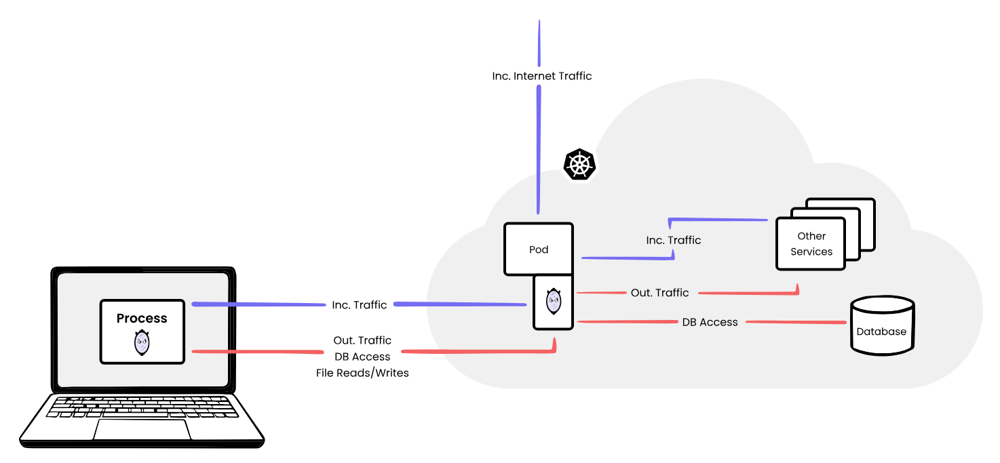

# Advanced Kubernetes Debugging Techniques

<!-- footer: Konrad F. Heimel, 2023-08-17 -->

---

# Agenda


- **mirrord** 💻<br>
  Transfer your IDE into the Kubernetes cluster
- **inspector gadget** 🔍<br>
  Cloud-native debugging using eBPF
- **ephemeral containers** 🌩️<br>
  Debug running pods without tools in the container image

---


# What is **mirrord**? 🧩

- 🚀 Connects a local process to your Kubernetes cluster.
- 📲 Comes with CLI & plugins for IntelliJ and VS Code.
- 🌩️ Debug in the cloud, without deploying.
- 🔄 Test locally in cloud conditions:
  - 🚫 Without local deployment
  - 🚫 Without CI/CD
  - 🚫 Without deploying untested code

---

# How does it work?

<font size="4">

1. Creates a **mirrord-agent** in the cluster:
  - 🔄 Clones/steals & forwards traffic
2. Overrides local process' syscalls to:
  - 🔊 Listen to agent's incoming traffic.
  - 🔜 Send out traffic from remote pod.
  - 📂 Access remote file system.
  - 🌍 Merge pod's environment with local.

</font>

<div align="center">

</div>

---

# Language/Framework Support

- 📚 Hooks `libc`, supporting:
  - Rust
  - Node
  - Python
  - Java
  - Kotlin
  - Ruby
  - ... and others!
- 🚀 Also supports Go, not using `libc`.

---


# Installation on Cluster?

<div class="columns">

<div class="left">
<font size="5">

- 🚫 Nothing persistent.
- 🌌 Short-lived pod/container for proxy.
- 🔌 Only needs `kubectl` configured.
- ⛔ **Incompatible with Pod Security Standards.**

</font>
</div>

<div class="right">
<font size="3">

```yaml
apiVersion: v1
kind: Pod
metadata:
  name: mirrord-agent-lgfcl4ujer-mxbgp
spec:
  containers:
    - image: ghcr.io/metalbear-co/mirrord:3.56.1
      name: mirrord-agent
      securityContext:
        capabilities:
          add:
            - SYS_ADMIN
            - SYS_PTRACE
            - NET_RAW
            - NET_ADMIN
        runAsGroup: 7318
      volumeMounts:
        - mountPath: /host/run
          name: hostrun
        - mountPath: /host/var
          name: hostvar
  hostPID: true
  volumes:
    - hostPath:
        path: /run
      name: hostrun
    - hostPath:
        path: /var
      name: hostvar
```
</font>

</div>

</div>

---

# Configuration 🔧

<div class="columns">
<div class="left">
<font size="5">

-  `target`: Pod/group you connect to.
- `env`: Merge pod's and local's environment.
- `networking.mode`:
  - `steal`: Capture incoming
  - `mirror`: Sniff & forward a copy
-  `fs.mode`:
  - `localwithoverrides`: Read Kubelet-generated files.

</font>
</div>
<div class="right">

```json
{
  "kube_context": "my-cluster",
  "accept_invalid_certificates": false,
  "target": {
    "path": "deploy/spring-demo-chart",
    "namespace": "mirrord-demo"
  },
  "feature": {
    "network": {
      "incoming": {
        "mode": "mirror",
        "outgoing": true
      },
      "dns": true
    },
    "fs": {
      "mode": "localwithoverrides"
    },
    "env": true
  },

  "telemetry": false
}
```

</div>
</div>

---

# **Advantages of mirrord**

- 🔄 Mirrors traffic ensuring safety.
- 📂 Flexibly manage traffic and file operations.
- 🌟 Superior to local clusters: Handles complex environments.
- 🚫 No installation of infrastructure on cluster required.
- 🚫 No cluster deployments: Stable code remains.
- 🌐 Connects specific services to the cloud.


---

<!-- _class: default -->

# **mirrord vs. Telepresence** 🤜🤛

<div class="columns">
<div class="left">


- 🚀 Process-level operation (no daemons).
- 🌌 Run multiple services concurrently.
- 🛠 No cluster installation needed.
- 🔍 Duplicates traffic by default.
- 📌 IDE extensions available!

</div>
<div class="right">
    <div style="display: flex; justify-content: center; align-items: center; flex-direction: column; height: 100%;">
        
vs
        
    </div>
</div>

</div>

---

<!-- _class: default -->


<div style="text-align: center; margin-top: 40px;">

<font size="20">
🎥 Live Demo
</font>

</div>

---

<!-- _class: center -->

<div align="center">
<br>
</div>

<font size="5">

- 🔧 Collection of eBPF-based tools for Kubernetes apps.
- 📊 Collects low-level kernel data.
- 🏷️ Enriches with Kubernetes metadata.
- 🚀 Mechanism to deploy eBPF tools to Kubernetes clusters.
- 🖥️ CLI tool `ig` for tracing containers.
- 📈 Prometheus metrics endpoint.

</font>

---

# Introduction to eBPF 🔎

<div class="columns">
<div class="left">


- 🖥️ Linux kernel technology.
- 📝 Restricted C subset programs.
- 🔄 Compiled to special bytecode.
- 🛡️ Validated before kernel execution.

</div>
<div class="right">

```python
from __future__ import print_function
from bcc import BPF
from bcc.utils import printb

# load BPF program
b = BPF(text="""
TRACEPOINT_PROBE(random, urandom_read) {
    // args is from /sys/kernel/debug/tracing/events/random/urandom_read/format
    bpf_trace_printk("%d\\n", args->got_bits);
    return 0;
}
""")

# header
print("%-18s %-16s %-6s %s" % ("TIME(s)", "COMM", "PID", "GOTBITS"))

# format output
while 1:
    try:
        (task, pid, cpu, flags, ts, msg) = b.trace_fields()
    except ValueError:
        continue
    except KeyboardInterrupt:
        exit()
    printb(b"%-18.9f %-16s %-6d %s" % (ts, task, pid, msg))
```

</div>
</div>

---

<!-- _footer: "Source: https://www.brendangregg.com/ebpf.html" -->


---

# The Gadgets 🧰


---

# **Installing Inspector Gadget** 🛠️

Install Inspector Gadget using [Krew](https://krew.sigs.k8s.io/) kubectl plugin manager:

```bash
$ kubectl krew install gadget
```

Deploy Inspector Gadget on Kubernetes:

```bash
$ kubectl gadget deploy

Creating Namespace/gadget...
...
Creating DaemonSet/gadget...
...
Inspektor Gadget successfully deployed
```

---

# Inspektor Gadget Overview 🕵️‍♂️

<div class="columns">
<div class="left">

- Provides a trace Custom Resource Definition (CRD) for control.
- Interaction through kubectl gadget CLI.
- Gadget pod has a Kubernetes controller to perform CR actions.
- eBPF program installation via tracers from trace CRD.
- eBPF: Inbuilt kernel VM allowing userspace scripts in kernel space.

</div>
<div class="right">


</div>
</div>

---

<div style="text-align: center; margin-top: 40px;">

<font size="20">
🎥 Live Demo
</font>

</div>

---

# Further Resources 🔗

- [mirrord](https://mirror-networking.gitbook.io/docs/)
- [inspector gadget](https://github.com/inspektor-gadget/inspektor-gadget#readme)
- [eBPF Basics](https://ebpf.io/what-is-ebpf/)

Related Tools

- [Krew kubectl Plugin Manager](https://krew.sigs.k8s.io/)
- [BPF Compiler Collection (BCC)](https://github.com/iovisor/bcc)
