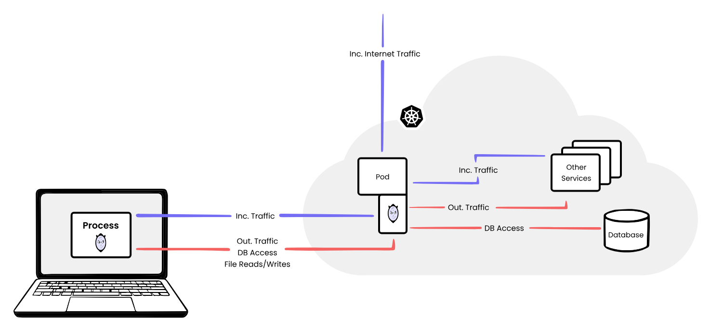
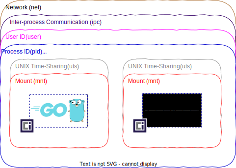
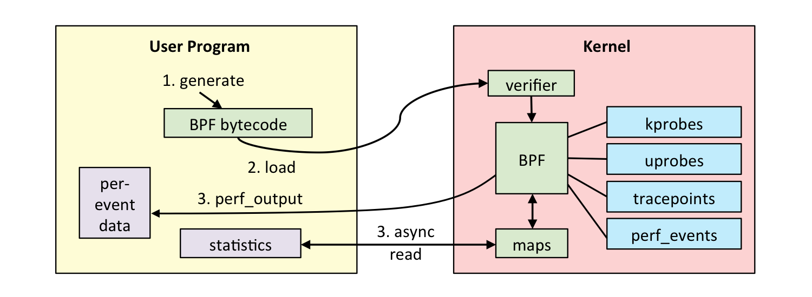
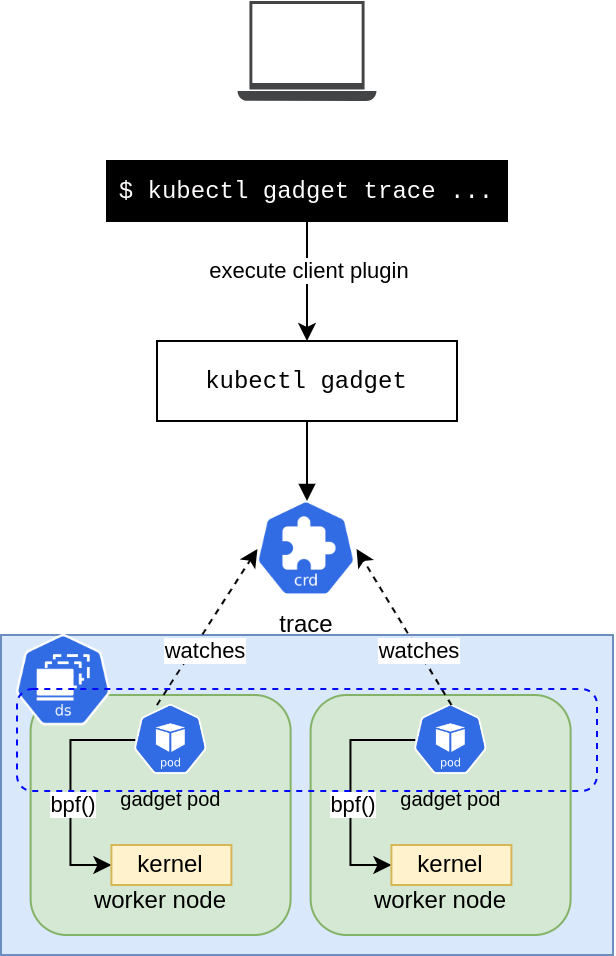
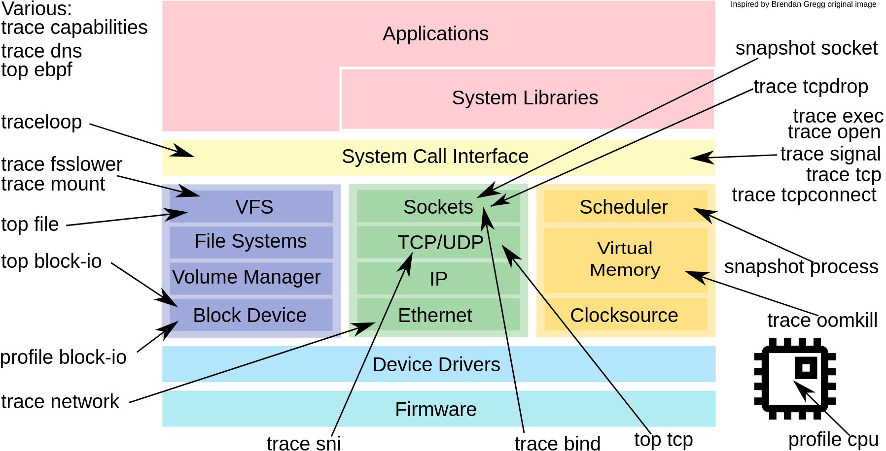
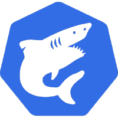
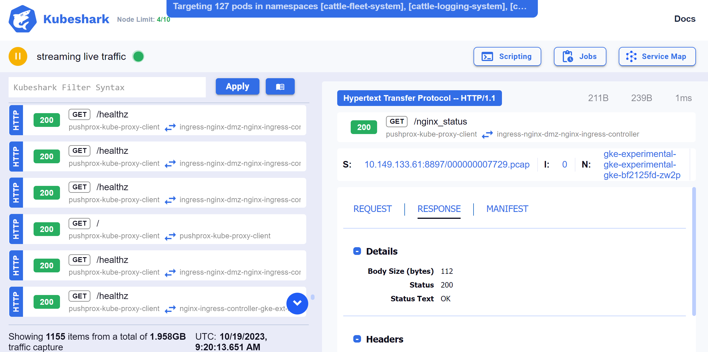
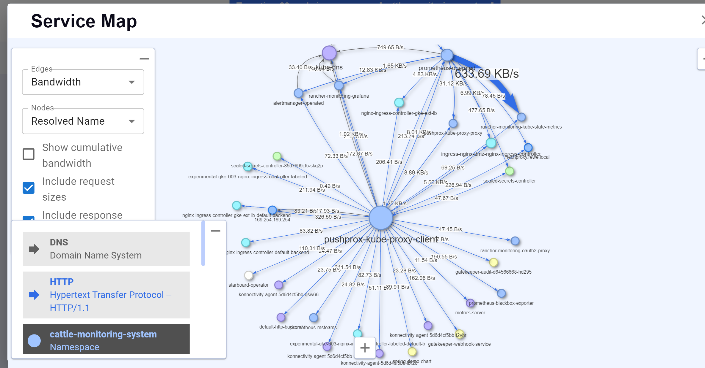

<!-- _class: invert -->


# Kubernetes Network Debugging

## Tools and Techniques to make one of the most frustrating parts of Kubernetes easier

<!-- footer: Konrad F. Heimel, 2023-10-19 -->

---

# Agenda


- **mirrord** 💻<br>
  Transfer your IDE into the Kubernetes cluster
- **ephemeral containers** 📦<br>
  Using debug tools without bloating your images
- **inspector gadget** 🔍<br>
  Cloud-native debugging using eBPF
- **kubeshark** 🦈<br>
  API traffic analyzer for Kubernetes

---

# Containers and Networking Challenges for Developers 📦🌐
<font size="5">

### Consistency in Containers 🔄

- Application + Dependencies = Consistent **file** environment.

### Networking Issues ⚠️
- Containers don't ensure networking consistency.
- **Network differences** ➡️ Main source of errors.

### Kubernetes Locally? 🤔💻
- Replicating full Kubernetes = Resource intensive & confusing.
- Not feasible for every developer.
</font>
---


# What is **mirrord**? 🧩

- 🚀 Connects a local process to your Kubernetes cluster.
- 📲 Comes with CLI & plugins for IntelliJ and VS Code.
- 🌩️ Debug in the cloud, without deploying.
- 🔄 Test locally in cloud conditions:
  - 🚫 Without local deployment
  - 🚫 Without CI/CD
  - 🚫 Without deploying untested code

---

<!-- _class: default -->


<div style="text-align: center; margin-top: 40px;">

<font size="20">
🎥 Live Demo
</font>

</div>

---

# How does it work?


<font size="4">

1. Creates a **mirrord-agent** in the cluster:
- 🔄 Clones/steals & forwards traffic
2. Overrides local process' syscalls to:
- 🔊 Listen to agent's incoming traffic.
- 🔜 Send out traffic from remote pod.
- 📂 Access remote file system.
- 🌍 Merge pod's environment with local.

</font>

<div align="center">

</div>

---


# Language/Framework Support

- 📚 Hooks `libc`, supporting:
  - Rust
  - Node
  - Python
  - Java
  - Kotlin
  - Ruby
  - ... and others!
- 🚀 Also supports Go, not using `libc`.

---


# Installation on Cluster?

<div class="columns">

<div class="left">
<font size="5">

- 🚫 Nothing persistent.
- 🌌 Short-lived pod/container for proxy.
- 🔌 Only needs `kubectl` configured.
- ⛔ **Incompatible with Pod Security Standards.**

</font>
</div>

<div class="right">
<font size="3">

```yaml
apiVersion: v1
kind: Pod
metadata:
  name: mirrord-agent-lgfcl4ujer-mxbgp
spec:
  containers:
    - image: cdp-docker-demo-images.artifactory.rewe.local/cicd/cdp-demo/spring-boot-greenfield-app:main-074f468c
      name: greenfield
  ephemeralContainers:
  - command:
      - ./mirrord-agent
      - -l
      - "49332"
      - -e
    image: ghcr.io/metalbear-co/mirrord:3.56.1
    imagePullPolicy: IfNotPresent
    name: mirrord-agent-mszkpupjeb
    securityContext:
      capabilities:
        add:
          - SYS_ADMIN
          - SYS_PTRACE
          - NET_RAW
          - NET_ADMIN
      runAsGroup: 44448
```
</font>

</div>

</div>

---

# Configuration 🔧

<div class="columns">
<div class="left">
<font size="5">

-  `target`: Pod/group you connect to.
- `env`: Merge pod's and local's environment.
- `networking.mode`:
  - `steal`: Capture incoming
  - `mirror`: Sniff & forward a copy
-  `fs.mode`:
- `localwithoverrides`: Read Kubelet-generated files.

</font>
</div>
<div class="right">

```json
{
  "kube_context": "my-cluster",
  "accept_invalid_certificates": false,
  "target": {
    "path": "deploy/spring-demo-chart",
    "namespace": "mirrord-demo"
  },
  "feature": {
    "network": {
      "incoming": {
        "mode": "mirror",
        "outgoing": true
      },
      "dns": true
    },
    "fs": {
      "mode": "localwithoverrides"
    },
    "env": true
  },

  "telemetry": false
}
```

</div>
</div>

---

# **Advantages of mirrord**

- 🔄 Mirrors traffic ensuring safety.
- 📂 Flexibly manage traffic and file operations.
- 🌟 Superior to local clusters: Handles complex environments.
- 🚫 No installation of infrastructure on cluster required.
- 🚫 No cluster deployments: Stable code remains.
- 🌐 Connects specific services to the cloud.


---

<!-- _class: default -->

# **mirrord vs. Telepresence** 🤜🤛

<div class="columns">
<div class="left">


- 🚀 Process-level operation (no daemons).
- 🌌 Run multiple services concurrently.
- 🛠 No cluster installation needed.
- 🔍 Duplicates traffic by default.
- 📌 IDE extensions available!

</div>
<div class="right">
    <div style="display: flex; justify-content: center; align-items: center; flex-direction: column; height: 100%;">
        
vs
        
    </div>
</div>

</div>

---

# Introduction to Ephemeral Containers 🌫️📦

- Not part of the pod's spec, but born as needed. 🚀
- Share namespaces with containers in the same pod. 🤝
- Powerful for understanding & diagnosing app behavior. 🔍
- Stable since Kubernetes v1.25 ✅
- Once created, they can't be deleted. ❌🗑️

---

# Using Ephemeral Containers for Debugging 🐞🔧

- Inspect a running pod without halting its operation. 🛠️
- Don't need tools outside your production image. 🖼️
- Communicate over localhost, use IPC, inspect processes, and access shared volumes. 🔗🗄️
- Debug command example:
  ```bash
  k debug --image=nicolaka/netshoot -it -- /bin/bash
  ```
---

### Basic Network Debugging Commands 🌐
1. `ping <hostname/IP>` - Check network connectivity.
2. `netstat -tuln` - Display listening ports.
3. `nslookup <hostname>` - DNS lookup.
4. `traceroute <hostname/IP>` - Trace network path.
5. `ifconfig` or `ip a` - Display network interfaces.

---

# Kubernetes and Linux Namespaces
<!-- _class: default -->

<div class="columns">
<div>

- Linux namespaces provide isolated environments with unique resources
- The container runtime leveraged by Kubernetes creates a new set of namespaces for each pod, ensuring isolated network, IPC, UTS, and PID environments.
- Sidecar containers, deployed in the same pod as the primary container, share most namespaces, enabling inter-container communication.

</div>

<div>



</div>
</div>

---

<!-- _class: center -->

<div align="center">
<br>
</div>

<font size="5">

- 🔧 Collection of eBPF-based tools for Kubernetes apps.
- 📊 Collects low-level kernel data.
- 🏷️ Enriches with Kubernetes metadata.
- 🚀 Mechanism to deploy eBPF tools to Kubernetes clusters.
- 🖥️ CLI tool `ig` for tracing containers.
- 📈 Prometheus metrics endpoint.

</font>

---

<div align="center">

</div>

<div class="columns">
<div class="left">


- 🖥️ Linux kernel technology.
- 📝 Restricted C subset programs.
- 🔄 Compiled to special bytecode.
- 🛡️ Validated before kernel execution.

</div>
<div class="right">

```python
from __future__ import print_function
from bcc import BPF
from bcc.utils import printb

# load BPF program
b = BPF(text="""
TRACEPOINT_PROBE(random, urandom_read) {
    // args is from /sys/kernel/debug/tracing/events/random/urandom_read/format
    bpf_trace_printk("%d\\n", args->got_bits);
    return 0;
}
""")

# header
print("%-18s %-16s %-6s %s" % ("TIME(s)", "COMM", "PID", "GOTBITS"))

# format output
while 1:
    try:
        (task, pid, cpu, flags, ts, msg) = b.trace_fields()
    except ValueError:
        continue
    except KeyboardInterrupt:
        exit()
    printb(b"%-18.9f %-16s %-6d %s" % (ts, task, pid, msg))
```

</div>
</div>


---

# eBPF Overview
<!-- _footer: "Source: https://www.brendangregg.com/ebpf.html" -->



---

# Inspektor Gadget Overview 🕵️‍♂️

<div class="columns">
<div class="left">

- Provides a trace Custom Resource Definition (CRD) for control.
- Interaction through kubectl gadget CLI.
- Gadget pod has a Kubernetes controller to perform CR actions.
- eBPF program installation via tracers from trace CRD.
- eBPF: Inbuilt kernel VM allowing userspace scripts in kernel space.

</div>
<div class="right">



</div>
</div>

---

<!-- _class: default -->


<div style="text-align: center; margin-top: 40px;">

<font size="20">
🎥 Live Demo
</font>

</div>

---

# The Gadgets 🧰



---

# **Installing Inspector Gadget** 🛠️

Install Inspector Gadget using [Krew](https://krew.sigs.k8s.io/) kubectl plugin manager:

```bash
$ kubectl krew install gadget
```

Deploy Inspector Gadget on Kubernetes:

```basha
$ kubectl gadget deploy

Creating Namespace/gadget...
...
Creating DaemonSet/gadget...
...
Inspektor Gadget successfully deployed
```

---

<div align="center">
<br>
</div>


# Kubeshark – API Traffic Analyzer for Kubernetes 🦈


- Think Wireshark re-invented for Kubernetes 🧰
- Real-time, identity-aware, protocol-level visibility into K8s API traffic 📊

---

# Kubeshark in Action 🌐

1. **Network Analysis**: Real-time protocol-level visibility & troubleshooting
2. **Investigating Traffic**: Filter and inspect pod-to-pod communication
3. **Security Auditing**: Identify suspicious traffic patterns & threats
4. **Historic Traffic Analysis**: Analyze past traffic snapshots
5. **Connectivity Troubleshooting**: Diagnose network errors & latency issues

---



---



---

# Kubeshark: Tracing Encrypted Traffic 🦈🔒

- **How?** Using **eBPF** to sniff encrypted TLS traffic without decryption.
  - Hooks into OpenSSL & Go's crypto/tls package.
- **Deploy Kubeshark with TLS Sniffing**:
  ```bash
  kubeshark tap --tls -n kh-demo
  ```
- Supports OpenSSL & Go's crypto/tls.

---

# Further Resources 🔗

- [mirrord](https://mirror-networking.gitbook.io/docs/)
- [inspector gadget](https://github.com/inspektor-gadget/inspektor-gadget#readme)
- [eBPF Basics](https://ebpf.io/what-is-ebpf/)
- [kubeshark](https://kubeshark.co/)
Related Tools

- [Krew kubectl Plugin Manager](https://krew.sigs.k8s.io/)
- [BPF Compiler Collection (BCC)](https://github.com/iovisor/bcc)
